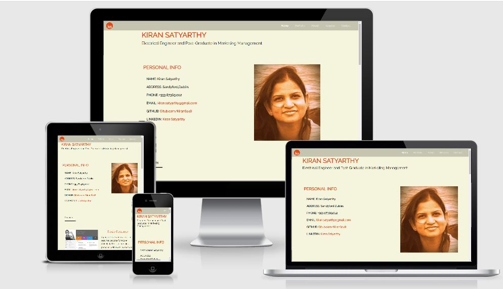

# Kiran Satyarthy
## Electrical Engineer and Post-Graduate in Marketing Management

[view live site here]()

 

 A resume website for myself, **Kiran Satyarthy**. I am an Engineer and currently pursuing a Full-Stack development diploma from **Code Institute**. 
 This is a single-page website with a 3-page length. This website is made for Recruiters and Employers. This website features my *Personal Information*, *Profile Picture*,
  *Projects* done with Code Institute until now, A *blog* about me, *CV PDF* in the resume section, and *Contact* details.
***

  ## **UX**

 ### **User Stories**

 1. Recruiters want to see the past work experience of the client.
 2. Recruiters want to see the educational qualification of the client.
 3. Recruiters want to know what the employee thinks about herself/himself.
 4. They want to easily navigate through the site and get a pdf of cv if they want.

 ### **5 Planes**---

### **Strategy**
  I wanted a simple website for Recruiters and Employers. Which should be easy to navigate and get information.

### **Scope**
  I wanted to add my past work experiences and present ongoing course details on the site.

### **Structure**
 I wanted the visitor of the site to easily get to see the live URL of my projects, 
 Easily connect to my GitHub and LinkedIn. and if they want they can download the pdf version of my CV also.

### **Skeleton**
 *Wireframes*
 Wireframe, which was made in the initial stage of product development is a little different from the final product.
During the development, I thought that it would be wise to add one profile image on the home page.
 So that everybody will know who they are talking about. I thought of adding code institute past project links and live URLs also.
  So that the recruiters can get a clear picture of my skill.

*The initial wireframe can be seen here*  [wireframe](assets/docs/wireframe.pdf)

### **Surface**
 The background color is kept beige to give a calm and smooth feeling. 
***

## **Features**-----

### **Typography**--
The background color of the website is kept **beige** and the font color is **dark orange** for headings and **black** for the rest of the texts. 
The font family is **"Raleway"** throughout the page. 

### **Navigation bar**---
This website features a **Responsive** navigation bar on the top of the page with a logo on the left and menu links on the right. The logo is linked to the home page of the site.
 Menu links are linked to the **Project** section, **About** section, **Resume** section, and **Contact** section.

### **Home**---
The home page is having a big heading with my name on top and some description beneath that.
It has a **Personal Information** section, which is having details about *Full Name*, *Address*, *Telephone number*, *Email link*, link to *GitHub*, 
and link to the *LinkedIn* site. It has one large *Profile picture* to get a better idea about me.

### **Projects**---
The Project section is having details and descriptions of 3 projects done with the **Code Institute** until now. Those are *Rosie resume project*, *Whiskey drop site*,
 and *Love running site*. The image of the project is linked to the live **URL** of the project and the heading is connected to **GitHub.io** or **Repl.it** repositories.

### **About**---
The about section is a **blog** about me, which tells about the *educational background*, my immigration from India, and some family background details.
 It also has mentioned my *current engagement with Code Institute*, where I am pursuing a Diploma right now. An inspirational quote is also added in the end.

### **Resume**--
The resume section is a link to the pdf of my **CV**. It opens the cv on a different page and that pdf can be downloaded.

### **Contact**---
The contact section has my **Email** address in bold, which opens the default email client to send a direct email from the webpage.
It also has one form for the client where they can submit their **project description** if they like my resume.

### **Footer**---
The footer section has a link to download the cv on its left side, by clicking on the font awesome icon of download. That icon changes its color to dark orange when it hovers over.
On the right side, It has 3 links to social networks **Github**, **Linkedin**, and **Twitter**. Which are represented by their *Font Awesome* icons.
 It changes its color to dark orange when hovered over and links to respective opens on a different page.
 ***

 ## Technologies used---

 ### **Language used**
 [HTML](https://en.wikipedia.org/wiki/HTML) and [CSS](https://en.wikipedia.org/wiki/CSS)  are the main languages used to write code and design the site.

 ### **Frameworks and other technologies used**
 * [BootstrapCDN](https://en.wikipedia.org/wiki/BootstrapCDN) is used to make the site more responsive.
 * [Github](https://en.wikipedia.org/wiki/GitHub) is used to make **repositories** and for **Version Control**.
 * [Gitpod](https://en.everybodywiki.com/Gitpod) is the main IDE used for this project. Workspaces are made using Gitpod.
 * [Font Awesome](https://en.wikipedia.org/wiki/Font_Awesome) is used to import some fonts to beautify the site.
 * [Google Fonts](https://en.wikipedia.org/wiki/Google_Fonts) is used to import fonts for this project. The main font for this project is "Raleway".
 * [Balsamiq](https://en.wikipedia.org/wiki/Balsamiq) is used to make wireframes for the project in the skeleton stage.
 * [AutoPrefixer](http://autoprefixer.github.io/) is used to make sure to code is valid for all browsers.
 * [W3C Validator](https://validator.w3.org/) is used for testing HTML and CSS for the site.
 ***

## **Testing**--

* W3C Markup Validation Service is used for the testing of the **HTML** and **no error** was found. The result can be seen here [HTML Test](assets/docs/html-test.JPG)
* W3C CSS Validation service is used to check the **CSS** of the project and **no error** was found. The result can be seen here. [CSS Test](assets/docs/css-test.JPG)
* The Project was tested for Browser compatibility. It was found that the navbar was not being fixed in other browsers. Which was fixed by checking codes in **AutoPrefixer.github.io** and updating 
the CSS. That issue is resolved now.

### *Manual Testing of all elements and functionality of every page.*---
* **Navigation Bar**
    
    The Navigation bar was tested for its links and for its responsiveness. The links were working properly and PDF is opening in a different window.
    The navbar is responsive also for every device. But in the mobile view, it does not collapse back after clicking on a link. This can be viewed as an **open bug** in the navbar.
* **Heading**

    The heading section was checked for its media query, It was found that the media query is working properly.
* **Personal Info section**

    The personal info section was checked for its details and links. All the details are correct and all links open in a different window.

* **Profile Image**
    
    Profile Image was tested for its responsiveness and it was found that it is responsive to all devices.
* **PortFolio**

    The Portfolio section consists of projects done with **Code Institute** until now. Each image is linked to the live **URL** of the project, 
    which is tested and it's found that it is  working fine. Each **title name** of the project is connected to **Github.io** and **Repl.it** repository of 
    that particular project. That link is also working fine. The section is responsive, Which is tested and verified.
* **About Me**

    About section consists of a blog about me. The content is verified and spelling check is done by online spelling and grammar checker [Grammarly.com](https://app.grammarly.com/).
    Few spelling mistakes were found, which were corrected.
* **Contact**

    The contact section has my email address and one form. Email opens the host client automatically when clicked, It was tested and was found that it is working fine as required.
    All input sections of the forms are tested by putting some name and email and it is discovered that each section is giving a pop-up mentioning that it should be filled. 
    After filling every section button can be clicked and remain on the same page. all these features are working fine.
* **Footer**

    The footer is tested for its download link, and the pdf is opening on a different page. The social network icons were clicked and checked, they were opening social networks
    in a different window. All the features in this section were working fine as expected.

**Project Barrier**

 The initial CDN links which were attached in the head element was an older version and that started giving the error in Bootstrap. Especially in the navbar. This is later spotted by my Mentor 
 and was corrected after adding new CDN's from [cdnjs.com](https://cdnjs.com/)

**Bug report**

The navbar is not collapsing back after clicking on it, in the mobile view.
***

## **Deployment**---

This project is developed using the **Github** repository. Coding is done in the workspace 
provided by **Gitpod**.

Steps were taken to deploy the project--
1. Log into **Github**.
2. Select **Kiran6248/MS1-KiranResume**.
3. Go to settings on the top right and scroll down to Github Pages.
4. Under source link dropdown change the none to **master** branch.
5. The page will be refreshed automatically and we will have a link to the **live URL**.

To run locally, You can clone this repository directly in the editor of your choice by

 ``git clone``  and adding the URL of the site.
    
`git clone http://github.com/Kiran6248/MS1-KiranResume`
    and the local clone will be created.
***

## **Credits**---

### **Content**--

All the content in the personal info section and About section is written by me.

### **Media**--

* The profile Photo used for the site is my photo.
* The Screenshots of all the live URL of the project were taken by
**Snipping Tool**.
* All the images used in the site were minimized by http://tinypng.com.

### **Codes**---

* The CDN links for Bootstarp, Font Awesome, Hover ,and jQuery were copied from http://cdnjs.com/
* Code used in making Navbar is copied from [Bootstarp Navbar](https://getbootstrap.com/docs/4.5/components/navbar/)
* Code used in making Contact form and Footer are referred from Rosie-Resume MINIproject of Code Institute.

### **Acknowledgment**--

My mentor **Adegbenga Adeye** for guiding me in every step and giving me great ideas to implement in my site.
***

